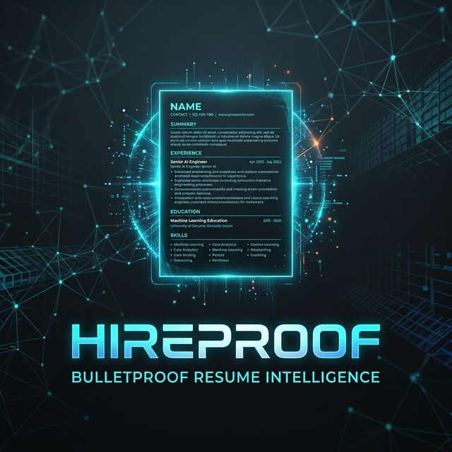

# HIREPROOF | AI-Powered Resume Intelligence

<div align="center">
  
  <br />
  <p align="center">
    <strong>Build bulletproof, ATS-optimized resumes with surgical precision.</strong>
  </p>
</div>

---

## 🚀 Overview

**HIREPROOF** is an advanced AI intelligence suite designed to bridge the gap between human expertise and machine-readable perfection. By leveraging multi-model AI architectures, HIREPROOF transforms your professional history into high-converting resumes and cover letters that pass every ATS filter and capture recruiter attention instantly.

---

## 🔥 Key Features

### 🧠 Resume Intelligence

- **Multi-Model Support**: Failover logic across **5+ AI Providers** (OpenAI, Anthropic, Gemini, NVIDIA, OpenRouter).
- **Knowledge Center**: A unified educational and skills system that maps your entire historical expertise.
- **ATS Infiltration**: Intelligent keyword mapping engineered to rank #1 in legacy and modern Application Tracking Systems.

### ✍️ Cover Letter Forge

- **Instant Tactical Correspondence**: Generate cover letters in **5 distinct strategic tones** (Bold, Creative, Modern, Personal, etc.).
- **Robust Parsing**: Local PDF ingestion and extraction — no cloud dependencies for raw data processing.
- **Strategic Variations**: Real-time comparison of AI-generated tones before final selection.

### 🎨 Design & Experience

- **High-Fidelity Preview**: Real-time, paper-simulated rendering with professional typography and timeline markers.
- **Instant PDF Forgery**: Direct-to-consumer A4 PDF generation using high-performance Puppeteer rendering.
- **Dynamic Interactions**: Fluid UI powered by GSAP and Framer Motion for a premium, spatial experience.

---

## 🛠️ Tech Stack

- **Frontend**: Next.js 15, TypeScript, Tailwind CSS v4, GSAP, Framer Motion, Zustand.
- **Backend**: Hono.js, Node.js, Redis (BullMQ), Puppeteer, PDF-Parse.
- **AI Engine**: LangChain, Multi-Provider API Integration.
- **Infrastructure**: Robust SEO optimization, PWA support, JSON-LD Schema.

---

## 🏁 Getting Started

### 📋 Prerequisites

- **Node.js**: v18+ (v20 recommended)
- **Redis**: Running instance for task queuing.
- **AI API Keys**: Valid keys for OpenAI, Gemini, etc. (configured in `.env`).

### 🛠️ Local Running

1. **Clone the repository**:

   ```bash
   git clone https://github.com/Saurabhdixit93/HIREPROOF-AI-Powered-Resume-Intelligence.git
   cd HIREPROOF-AI-Powered-Resume-Intelligence
   ```

2. **Setup Environment Variables**:
   Copy the example environment files and fill in your API keys:

   ```bash
   cp client/.env.example client/.env
   cp server/.env.example server/.env
   ```

3. **Install Dependencies & Launch**:
   We provide a convenient launch script that handles both client and server:

   ```bash
   chmod +x start.sh
   ./start.sh
   ```

   This script will:
   - Install all necessary dependencies for both modules.
   - Launch the Hono backend server.
   - Launch the Next.js development server.

---

## 📁 Architecture Overview

- **`/client`**: The high-fidelity Next.js application.
- **`/server`**: The Hono-powered API and AI service layer.
- **`start.sh`**: Centralized deployment and management script.

---

## 🤝 Contributing

We welcome contributions! Please feel free to submit PRs for features, bug fixes, or documentation improvements.

---

## 📄 License

© 2026 HIREPROOF. Created with surgical precision by **Saurabh Dixit**.
